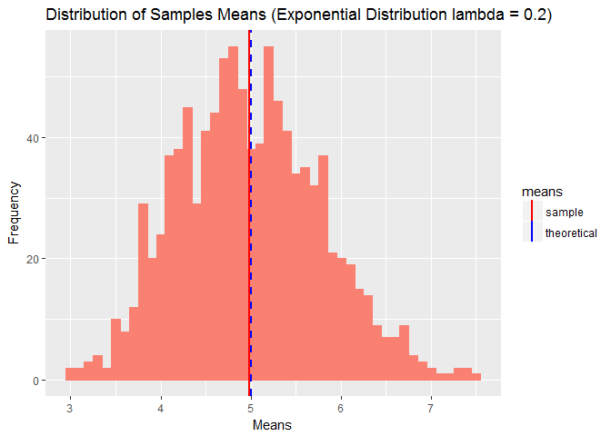
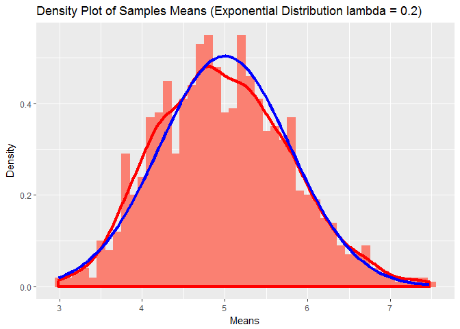

Course Project Part 1
=====================

Statistical Inference by Johns Hopkins University
-------------------------------------------------

### Introduction

In this part, using simulation, we will illustrate the properties of the
distribution of the mean of 40 exponentials. As part of the project, we
will investigate the exponential distribution in R and compare sample
mean/sample variance and theoretical mean/theoretical variance of the
distribution respectivelly. In addition, we will also investigate the
distribution and check whether the the Central Limit Theorem holds or
not.

The exponential distribution can be simulated in R with rexp(n, lambda)
where lambda is the rate parameter. The mean of exponential distribution
is 1/lambda and the standard deviation is also 1/lambda. We will set
lambda = 0.2 for all of the simulations, and investigate the
distribution of averages of 40 exponentials through one thousand
simulations.

### Simulations

Let's first create the variables for the simulation:

    n <- 40
    lambda <- 0.2
    num.of.sim <- 1000

Before running the simulation, we set the seed to 3 so that we will get
same results everytime we run the R code:

    set.seed(3)

Now we can create a thousand simulated averages of 40 exponentials with
lambda equal to 0.2. We keep all the generated simulations in a matrix
and then generate the mean of each simulation below:

    sim.data <- matrix(data = rexp(n * num.of.sim, lambda), nrow = num.of.sim, ncol = n)
    sim.data.mean <- data.frame(means=apply(sim.data, 1, mean))

### Sample Mean versus Theoretical Mean

Now let's find the sample mean and compare it to the theoretical mean of
the distribution. As mentioned above, the mean of exponential
distribution is 1/lambda. So, we first find the sample mean and
theoretical mean:

    sample.mean <- mean(sim.data.mean$means)
    sample.mean

    ## [1] 4.98662

    theoretical.mean <- 1.0/lambda
    theoretical.mean

    ## [1] 5

    sample.mean.plot <- ggplot(data = sim.data.mean, aes(x = means)) + geom_histogram(binwidth=0.1, fill = "salmon", color = "salmon") + geom_vline(aes(xintercept = sample.mean, color = "sample"), linetype=1, size = 1, show.legend=TRUE) + geom_vline(aes(xintercept = theoretical.mean, color = "theoretical"), linetype=2, size = 1, show.legend=TRUE) + scale_color_manual(name = "means", values = c(sample = "red", theoretical = "blue")) + ggtitle("Distribution of Samples Means (Exponential Distribution lambda = 0.2)") + xlab("Means") + ylab("Frequency")
    sample.mean.plot 

In the above plot, you can see the distribution of averages of 40
exponentials through one thousand simulations. In the plot, the blue
line represents the theoretical mean while red line represents the
sample mean obtained from the simulation. As you can see, mean values
are very close to each other.

### Sample Variance versus Theoretical Variance

Now let's find the sample variance and compare it to the theoretical
variance of the distribution. As mentioned above, the standard deviation
is 1/lambda. Futhermore, the average of a random sample from a
population is itself a random variable with variance (1/lambda)^2 / n.
So, let's first find the sample variance and theoretical variance:

    sample.variance <- var(sim.data.mean$means)
    sample.variance

    ## [1] 0.6257575

    theoretical.variance <- ((1.0/lambda)**2)/n
    theoretical.variance

    ## [1] 0.625

As you can see, sample variance and theoretical variance are also close.

### Distribution

In order to investigate whether the distribution resembles a normal
distribution, we plot the distribution of the sample means. In the below
figure we show both the sample density (red line) computed using the
histogram and the normal density (blue line) plotted with theoretical
mean and variance values. As you can see, two lines are pretty close
(even overlapping in some regions) which shows that the distribution is
approximately normal.

    distribution.plot <- ggplot(data = sim.data.mean, aes(x = means)) + geom_histogram(binwidth=0.1, aes(y = ..density..), fill = "salmon", color = "salmon") + geom_density(color = "red", size = 1.5) + stat_function(fun = dnorm, args = list(mean = theoretical.mean, sd = sd(sim.data.mean$means)), color = "blue", geom = "line", size = 1.5) + ggtitle("Density Plot of Samples Means (Exponential Distribution lambda = 0.2)") + xlab("Means") + ylab("Density")
    distribution.plot 

In addition, we can investigate whether the distribution resembles a
normal distribution through a Q-Q plot. A Q-Q plot is a scatterplot
created by plotting two sets of quantiles against one another. If both
sets of quantiles came from the same distribution, we should see the
points forming a line that's roughly straight. According to the below
plot, points seem to fall on a straight line which suggests that
distribution is approximately normal.

This is an expected result due to the Central Limit Theorem which states
that the arithmetic mean of a sufficiently large number of iterates of
independent random variables will be approximately normally distributed,
regardless of the underlying distribution. So even if the original
variables themselves are not normally distributed, the averages of
samples should follow a normal distribution, and as the number of
samples increase, the density distribution will get closer to the normal
distribution's bell curve.

    qqnorm(sim.data.mean$means);
    qqline(sim.data.mean$means)

