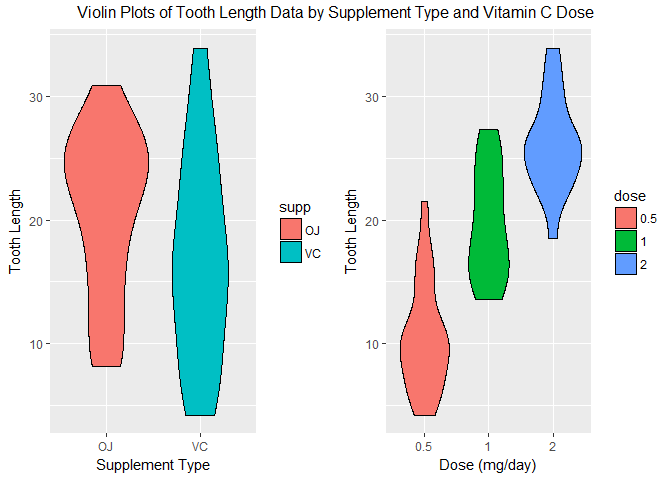
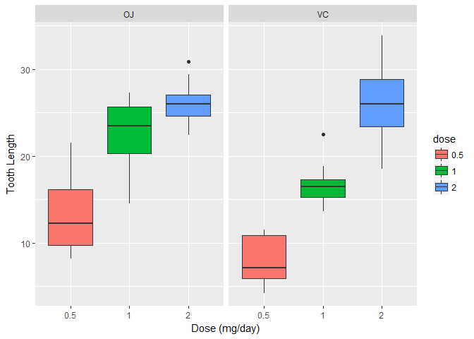
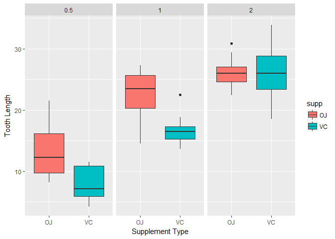

Course Project Part 2
=====================

Statistical Inference by Johns Hopkins University
-------------------------------------------------

### Introduction

Now in the second part of the project, we will analyze the ToothGrowth
data in the R datasets package. Using this dataset, our goal is to
investigate if any of the variables have an impact on the tooth growth.

### Data

The ToothGrowth data in the R datasets package come from a research
which is focused on finding the Effect of Vitamin C on Tooth Growth in
Guinea Pigs. The data set consists of the results of 60 guinea pigs.
Each animal received one of three dose levels of vitamin C (0.5, 1, and
2 mg/day) by one of two delivery methods, (orange juice or ascorbic acid
(a form of vitamin C and coded as VC). The response is the length of
odontoblasts (cells responsible for tooth growth).

Dataset contains 60 observations on 3 variables:

-   **len:** numeric Tooth length
-   **supp:** factor Supplement type (VC or OJ).
-   **dose:** numeric Dose in milligrams/day

So, we first load the ToothGrowth data to R, and take a look at the
variables:

    data(ToothGrowth)
    ToothGrowth$dose <- as.factor(ToothGrowth$dose)
    str(ToothGrowth)

    ## 'data.frame':    60 obs. of  3 variables:
    ##  $ len : num  4.2 11.5 7.3 5.8 6.4 10 11.2 11.2 5.2 7 ...
    ##  $ supp: Factor w/ 2 levels "OJ","VC": 2 2 2 2 2 2 2 2 2 2 ...
    ##  $ dose: Factor w/ 3 levels "0.5","1","2": 1 1 1 1 1 1 1 1 1 1 ...

### Exploratory Data Analyses

At this step, we perform some basic exploratory data analyses:

    summary(ToothGrowth)

    ##       len        supp     dose   
    ##  Min.   : 4.20   OJ:30   0.5:20  
    ##  1st Qu.:13.07   VC:30   1  :20  
    ##  Median :19.25           2  :20  
    ##  Mean   :18.81                   
    ##  3rd Qu.:25.27                   
    ##  Max.   :33.90

As you can see in the below table, all possible combinations of "supp"
and "dose" have same number of samples:

    table(ToothGrowth$supp, ToothGrowth$dose)

    ##     
    ##      0.5  1  2
    ##   OJ  10 10 10
    ##   VC  10 10 10

Now let's compare the variances between two supplement groups:

    var(ToothGrowth$len[ToothGrowth$supp == 'OJ'])

    ## [1] 43.63344

    var(ToothGrowth$len[ToothGrowth$supp == 'VC'])

    ## [1] 68.32723

And now the variances of three dose levels:

    var(ToothGrowth$len[ToothGrowth$dose == 0.5])

    ## [1] 20.24787

    var(ToothGrowth$len[ToothGrowth$dose == 1])

    ## [1] 19.49608

    var(ToothGrowth$len[ToothGrowth$dose == 2])

    ## [1] 14.24421

Based on the above values, we will assume unequal variances in the
statistical analysis.

Furthermore, below we have the violin plots of tooth length data by
supplement type and dose. As you can see, supplement type does not have
a significant impact on the toothgrowth while dose level has an positive
effect on the toothgrowth. This is just our initial estimate, let's take
a detail look to the two factors before starting the statistical
analysis.

    supp.plot <- ggplot(ToothGrowth, aes(x = supp, y = len, fill = supp)) + geom_violin(col = "black") + labs(x = "Supplement Type", y = "Tooth Length")

    dose.plot <- ggplot(ToothGrowth, aes(x = dose, y = len, fill = dose)) + geom_violin(col = "black") + labs(x = "Dose (mg/day)", y= "Tooth Length")

    grid.arrange(supp.plot, dose.plot, ncol = 2, top = "Violin Plots of Tooth Length Data by Supplement Type and Vitamin C Dose")

In the below box plots, we can see effect of vitamin dose on tooth
length separatelly for two supplement types. According to the plots, in
both supplement types, vitamin dose has an positive effect on the tooth
growth, but we will see if that is in fact the case in the next part.

    dose.box.plot <- ggplot(ToothGrowth, aes(x = dose, y = len)) + facet_grid(.~supp) + geom_boxplot(aes(fill = dose)) + labs(x = "Dose (mg/day)", y = "Tooth Length")
    dose.box.plot

Similarly, in the below box plots, we can see effect of supplement type
on tooth length separatelly for three vitamin dosages. According to the
plots, when the vitamin dose is 0.5 or 1 mg per day, orange juice is a
better supplement for tooth growth than ascorbic acid. On the other
hand, when the vitamin dose is 2 mp per day, supplement type has no
effect on the tooth growth. Let's see if we can prove this in the next
section statistically.

    supp.box.plot <- ggplot(ToothGrowth, aes(x = supp, y = len)) + facet_grid(.~dose) + geom_boxplot(aes(fill = supp)) + labs(x = "Supplement Type", y = "Tooth Length")
    supp.box.plot

### Statistical Inference Analysis

In this part of the project, we will investigate the relationship
between tooth growth vs. supplement type and vitamin dose. We will first
investigate the effect of supplement type and vitamin dose on tooth
growth separatelly, and then analyse their effect together.

#### Effect of supplement type on tooth growth

**Hypothesis:**

-   H0: There is **no** difference in tooth growth when using
    orange juice or ascorbic acid as the supplement type
-   Ha: There is a difference in tooth growth when using
    orange juice or ascorbic acid as the supplement type

<!-- -->

    OJ = ToothGrowth$len[ToothGrowth$supp == 'OJ']
    VC = ToothGrowth$len[ToothGrowth$supp == 'VC']

    t.test(OJ, VC)

    ## 
    ##  Welch Two Sample t-test
    ## 
    ## data:  OJ and VC
    ## t = 1.9153, df = 55.309, p-value = 0.06063
    ## alternative hypothesis: true difference in means is not equal to 0
    ## 95 percent confidence interval:
    ##  -0.1710156  7.5710156
    ## sample estimates:
    ## mean of x mean of y 
    ##  20.66333  16.96333

Here, p-value is larger than 0.05 and the confidence interval includes
zero. Therefore, we cannot reject the null hypothesis, and conclude that
supplement type has no effect on tooth growth.

#### Effect of vitamin dose on tooth growth

**Hypothesis:**

-   H0: There is **no** difference in tooth growth when
    receiving different levels of vitamin C dosage
-   Ha: There is a difference in tooth growth when receiving
    different levels of vitamin C dosage

<!-- -->

    half = ToothGrowth$len[ToothGrowth$dose == 0.5]
    one = ToothGrowth$len[ToothGrowth$dose == 1]
    two = ToothGrowth$len[ToothGrowth$dose == 2]

**0.5 vs 1 mg/day**

    t.test(half, one)

    ## 
    ##  Welch Two Sample t-test
    ## 
    ## data:  half and one
    ## t = -6.4766, df = 37.986, p-value = 1.268e-07
    ## alternative hypothesis: true difference in means is not equal to 0
    ## 95 percent confidence interval:
    ##  -11.983781  -6.276219
    ## sample estimates:
    ## mean of x mean of y 
    ##    10.605    19.735

According to the t-test, p-value is less than 0.05 and interval is
entirely below zero which means that we can reject the null hypothesis
and conclude that there is a difference in tooth growth when receiving
different levels of vitamin C dosage (0.5 mg/day vs 1 mg/day).

**0.5 vs 2 mg/day**

    t.test(half, two)

    ## 
    ##  Welch Two Sample t-test
    ## 
    ## data:  half and two
    ## t = -11.799, df = 36.883, p-value = 4.398e-14
    ## alternative hypothesis: true difference in means is not equal to 0
    ## 95 percent confidence interval:
    ##  -18.15617 -12.83383
    ## sample estimates:
    ## mean of x mean of y 
    ##    10.605    26.100

Similarly, the p-value is less than 0.05 and interval is entirely below
zero which suggest that receiving 0.5 mg vitamin per day leads to less
growth in tooth length than receiving 2 mg vitamin per day.

**1 vs 2 mg/day**

    t.test(one, two)

    ## 
    ##  Welch Two Sample t-test
    ## 
    ## data:  one and two
    ## t = -4.9005, df = 37.101, p-value = 1.906e-05
    ## alternative hypothesis: true difference in means is not equal to 0
    ## 95 percent confidence interval:
    ##  -8.996481 -3.733519
    ## sample estimates:
    ## mean of x mean of y 
    ##    19.735    26.100

Finally, when we compare 1 mg/day and 2 mg/day, the p-value is less than
0.05 and interval is entirely below zero. Therefore, we can conclude
that receiving 2 mg vitamin per day cause more tooth growth than
receiving 0.5 mg vitamin per day.

In conclusion, we see that there is a positive correlation between
vitamin dose and tooth growth. So, as we increase the vitamin dose, we
will observe larger growth in tooth length.

#### Effect of vitamin dose and supplement type on tooth growth

**Hypothesis:**

-   H0: There is **no** difference in tooth growth when
    receiving different levels of vitamin C dosage through orange juice
    or ascorbic acid as the supplement type
-   Ha: There is a difference in tooth growth when receiving
    different levels of vitamin C dosage through orange juice or
    ascorbic acid as the supplement type

Here we will first compare different supplement types when the vitamin
dose in constant:

    test.results.1 = data.frame(comparisons = character(), pvalues = numeric(), interval.start = numeric(), interval.end = numeric())

    t <- t.test(len ~ supp, data = subset(ToothGrowth, dose == 0.5))
    test.results.1 <- rbind(test.results.1, data.frame(comparisons = "0.5 mg with OJ vs 0.5 mg with VC", pvalues = t$p.value, interval.start = t$conf.int[1], interval.end = t$conf.int[2]))

    t <- t.test(len ~ supp, data = subset(ToothGrowth, dose == 1))
    test.results.1 <- rbind(test.results.1, data.frame(comparisons = "1 mg with OJ vs 1 mg with VC", pvalues = t$p.value, interval.start = t$conf.int[1], interval.end = t$conf.int[2]))

    t <- t.test(len ~ supp, data = subset(ToothGrowth, dose == 2))
    test.results.1 <- rbind(test.results.1, data.frame(comparisons = "2 mg with OJ vs 2 mg with VC", pvalues = t$p.value, interval.start = t$conf.int[1], interval.end = t$conf.int[2]))

    test.results.1

    ##                        comparisons     pvalues interval.start interval.end
    ## 1 0.5 mg with OJ vs 0.5 mg with VC 0.006358607       1.719057     8.780943
    ## 2     1 mg with OJ vs 1 mg with VC 0.001038376       2.802148     9.057852
    ## 3     2 mg with OJ vs 2 mg with VC 0.963851589      -3.798070     3.638070

As you can see from the above table, for 0.5 mg/day and 1 mg/day
dosages, p-values are both below 0.05 and confidence intervals are both
above zero. Therefore, we can reject the null hypothesis and conclude
that when either one of these two dose levels are received, orange juice
leads to higher tooth growth than ascorbic acid. However, when the
vitamin dose is 2 mg/day, p-value is larger than 0.05 and the interval
contains zero. So, we cannot reject the null hypothesis.

Now we will compare effects of receiving different vitamin dose levels
when the supplement type is constant:

    test.results.2 = data.frame(comparisons = character(), pvalues = numeric(), interval.start = numeric(), interval.end = numeric())

    t <- t.test(len ~ dose, data = subset(ToothGrowth, supp == "OJ" & dose != 2))
    test.results.2 <- rbind(test.results.2, data.frame(comparisons = "0.5 mg with OJ vs 1 mg with OJ", pvalues = t$p.value, interval.start = t$conf.int[1], interval.end = t$conf.int[2]))

    t <- t.test(len ~ dose, data = subset(ToothGrowth, supp == "OJ" & dose != 1))
    test.results.2 <- rbind(test.results.2, data.frame(comparisons = "0.5 mg with OJ vs 2 mg with OJ", pvalues = t$p.value, interval.start = t$conf.int[1], interval.end = t$conf.int[2]))

    t <- t.test(len ~ dose, data = subset(ToothGrowth, supp == "OJ" & dose != 0.5))
    test.results.2 <- rbind(test.results.2, data.frame(comparisons = "1 mg with OJ vs 2 mg with OJ", pvalues = t$p.value, interval.start = t$conf.int[1], interval.end = t$conf.int[2]))

    t <- t.test(len ~ dose, data = subset(ToothGrowth, supp == "VC" & dose != 2))
    test.results.2 <- rbind(test.results.2, data.frame(comparisons = "0.5 mg with VC vs 1 mg with VC", pvalues = t$p.value, interval.start = t$conf.int[1], interval.end = t$conf.int[2]))

    t <- t.test(len ~ dose, data = subset(ToothGrowth, supp == "VC" & dose != 1))
    test.results.2 <- rbind(test.results.2, data.frame(comparisons = "0.5 mg with VC vs 2 mg with VC", pvalues = t$p.value, interval.start = t$conf.int[1], interval.end = t$conf.int[2]))

    t <- t.test(len ~ dose, data = subset(ToothGrowth, supp == "VC" & dose != 0.5))
    test.results.2 <- rbind(test.results.2, data.frame(comparisons = "1 mg with VC vs 2 mg with VC", pvalues = t$p.value, interval.start = t$conf.int[1], interval.end = t$conf.int[2]))

    test.results.2

    ##                      comparisons      pvalues interval.start interval.end
    ## 1 0.5 mg with OJ vs 1 mg with OJ 8.784919e-05     -13.415634   -5.5243656
    ## 2 0.5 mg with OJ vs 2 mg with OJ 1.323784e-06     -16.335241   -9.3247594
    ## 3   1 mg with OJ vs 2 mg with OJ 3.919514e-02      -6.531443   -0.1885575
    ## 4 0.5 mg with VC vs 1 mg with VC 6.811018e-07     -11.265712   -6.3142880
    ## 5 0.5 mg with VC vs 2 mg with VC 4.681577e-08     -21.901512  -14.4184880
    ## 6   1 mg with VC vs 2 mg with VC 9.155603e-05     -13.054267   -5.6857333

In the above table, all p-values are below 0.05 and all intervals are
below 0. Therefore, for all combinations of vitamin dose and supplement
type, we can reject the null hypothesis. Furthermore, since all
intervals are below 0, we can conclude as we increase the vitamin dose
we will observe increase in tooth growth.

### Conclusions

Before summarizing the conclusions of this analysis, let's first list
our assumptions:

-   Underlying data is independent and identically distributed (i.i.d.)
-   Groups have unequal variances
-   Distribution of the means is normal
-   Sample is a good representation of the population

Finally, let's summarize the conclusions of this analysis:

-   In general, supplement type has no effect on tooth growth. However,
    orange juice leads to higher tooth growth than ascorbic acid when
    pigs receive either 0.5 mg or 1 mg Vitamin C daily.

-   There is a positive correlation between vitamin dose and
    tooth growth. So, as we increase the vitamin dose, we will observe
    higher tooth growth.
